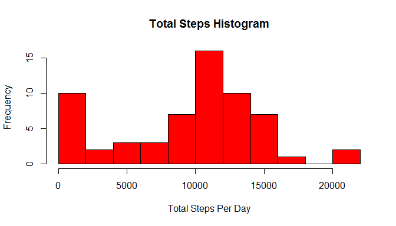
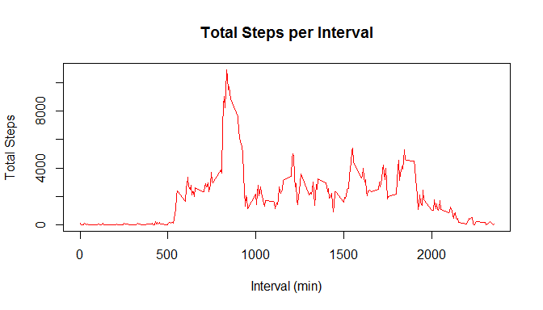
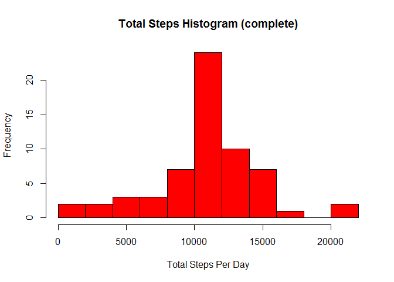
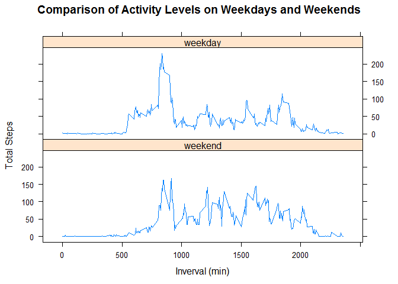

# Reproducible Research: Peer Assessment 1


## Loading and preprocessing the data


```r
#Load the required libraries:
library(dplyr)
```

```
## 
## Attaching package: 'dplyr'
```

```
## The following objects are masked from 'package:stats':
## 
##     filter, lag
```

```
## The following objects are masked from 'package:base':
## 
##     intersect, setdiff, setequal, union
```

```r
library(data.table)
```

```
## 
## Attaching package: 'data.table'
```

```
## The following objects are masked from 'package:dplyr':
## 
##     between, last
```

```r
library(lattice)
readData<-read.csv("activity.csv")
```


## What is mean total number of steps taken per day?

1. Calculate the total number of steps taken for each day

```r
#Organize the data by the date it was collected, then set steps variable to equal the 
#total number of steps for each day
byDate<- readData %>% group_by(date) %>% summarise(steps = sum(steps, na.rm = TRUE))

#Display histogram of total steps per day
hist(byDate$steps, col = "red", breaks = 10, xlab= "Total Steps Per Day", ylab = "Frequency", main="Total Steps Histogram")
```




2. This historgam shows the total number of steps taken per day


```r
#Mean steps taken per day 
meanSteps<-mean(byDate$steps)

#Median steps taken per day 
medianSteps<-median(byDate$steps)
```
3.The mean number of steps taken per day is 9354.2295082. The median number of steps taken per day is 10395 steps 


## What is the average daily activity pattern?


  
1. This plot shows the total steps for each 5-minute interval  

```r
#Organize by each 5 minute interval, with total for each interval
byMinute<- readData %>% group_by(interval) %>% summarise(steps = sum(steps, na.rm = TRUE))

#Plotting the total steps for each 5 min interval
with(byMinute, {
  plot(interval, steps, type="l",col = "red", xlab="Interval (min)", 
       ylab="Total Steps", main="Total Steps per Interval")
   
})
```



```r
#Determine which interval has the most steps
mostSteps<-byMinute$interval[which.max(byMinute$steps)]
```
2. The 5-minute inverval with the most steps is 835  


## Imputing missing values


```r
#Caclulate total number of missing data
totalMissing<- sum(is.na(readData))
```
1. The total number of missing data is 2304

2. To replace the missing data, we will use the mean for 
each 5-minute interval. First, we will calcualte the average steps for each interval. Then we will iterate through the data, replacing any missing data with the corresponding average data for that interval.


```r
#Group by interval, then give the average steps for each interval
avgSteps<- readData %>% group_by(interval) %>% summarise(steps = mean(steps, na.rm = TRUE))

#Convert to data.table for easier manipulation
avgTable<-data.table(avgSteps)
```

3. The new data set will have the missing data replaced with average values

```r
completeData<-readData

for(i in 1:nrow(completeData)){
  if(is.na(completeData$steps[i]))
  {
    completeData$steps[i]<- avgTable[interval == completeData$interval[i]]$step
  }
}
```

```r
#modify the data into a new df containing the total number of steps for each day
byDateComplete<- completeData %>% group_by(date) %>% summarise(steps = sum(steps))

#Historgram showing total steps per day
hist(byDateComplete$steps, col = "red", breaks = 10, xlab= "Total Steps Per Day", ylab = "Frequency", main="Total Steps Histogram (complete)")
```



```r
#Mean steps taken per day - 10766.19
meanComplete<-mean(byDateComplete$steps) 

#Median steps taken per day - 10766.19
medianComplete<-median(byDateComplete$steps)  
```
4. The histogram differs from the histogram generated with the incomplete data. 
In this histogram, the frequency of days with no steps at all is reduced, and the data
appear more uniformly distributed. 


The mean of this data set is 1.0766189\times 10^{4} and the median is 1.0766189\times 10^{4}. The mean has increased when compared to the first data set, and the median and mean are the same.

 

```


## Are there differences in activity patterns between weekdays and weekends?

1. Create the factor variable

```r
#Create vector of valid weekdays
wdays<- c("Monday", "Tuesday", "Wednesday", "Thursday", "Friday")

#Create new column with factor variable that specifies whether the day is a weekday or weekend
completeData$Weekday<- factor((weekdays(as.Date(completeData$date)) %in% wdays), levels = c("FALSE", "TRUE"),
                              labels = c("weekend", "weekday"))

#Create data frame grouped by interval and weekday or weekend, with total steps for each interval
byMinuteWeekday<- completeData %>% group_by(interval, Weekday) %>% summarise(steps = mean(steps))

#Create plot showing the difference in activity between weekdays and weekends
  xyplot(byMinuteWeekday$steps~byMinuteWeekday$interval|byMinuteWeekday$Weekday, 
         main="Comparison of Activity Levels on Weekdays and Weekends",
         xlab = "Inverval (min)",
         ylab = "Total Steps",
         layout = c(1,2),
         type = "l"
  )
```



2. This panel plot shows that the activity level seems to differ on the weekends: the user is not active until later in the day, but appears to have more active events overall. The user also stays active until later in the day on the weekends.
  
  
  
  
